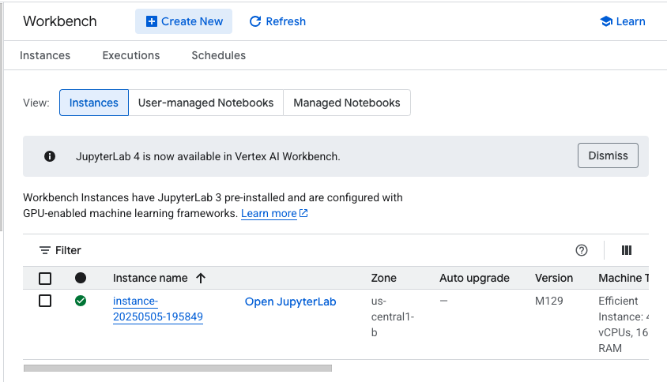
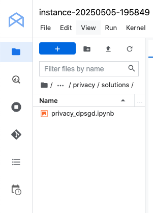
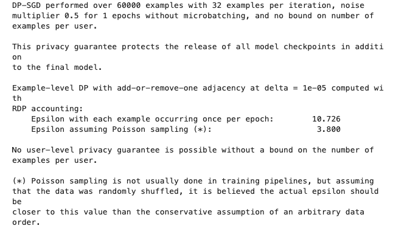

# GCP-LAB-Differential-Privacy-in-Machine-Learning-with-TensorFlow-Privacy
Differential Privacy in Machine Learning with TensorFlow Privacy

#### Overview
This lab helps you learn how to use differential privacy in machine learning using TensorFlow Privacy.

##### Learning objectives
1. Wrap existing optimizers into their differentially private counterparts using TensorFlow Privacy.
2. Practice checking hyperparameters introduced by differentially private machine learning.
3. Measure the privacy guarantee provided using analysis tools included in TensorFlow Privacy.


### Task 0. Setup and requirements

#### Enable the Notebooks API
1. In the Google Cloud Console, on the Navigation menu, click APIs & Services > Library.

2. Search for Notebooks API and press ENTER.

3. Click on the Notebooks API result, and if the API is not enabled, click Enable.

### Enable the Vertex AI API
1. In the Google Cloud Console, on the Navigation menu, click Vertex AI > Dashboard.

2. Click ENABLE ALL RECOMMENDED APIS.


### Task 1. Open Vertex AI Workbench instance

1. In the Google Cloud Console, on the Navigation Menu, click Vertex AI > Workbench.

2. On the Instance page, click CREATE NEW.

3. Please use the default zone and region: us-central1-b us-central1. Leave the remaining settings as they are and then click Create. The new VM will take 2-3 minutes to start.

4. Click Open JupyterLab. A JupyterLab window will open in a new tab.



### Task 2. Clone a course repo within your Vertex AI Workbench instance
To clone the notebook in your JupyterLab instance:

1. In JupyterLab, open a new terminal window.

2. At the command-line prompt, run the following command:


```
git clone https://github.com/GoogleCloudPlatform/asl-ml-immersion.git
cd asl-ml-immersion
export PATH=$PATH:~/.local/bin
make install
```

3. To confirm that you have cloned the repository, double-click on the asl-ml-immersion directory and ensure that you can see its contents. The files for all the Jupyter notebook-based labs throughout this course are available in this directory.



### Task 3. Implement Differential Privacy with TensorFlow Privacy

1. In the notebook interface, navigate to asl-ml-immersion > notebooks > responsible_ai > privacy > solutions and open privacy_dpsgd.ipynb.

2. In the notebook interface, click Edit > Clear All Outputs.

3. Carefully read through the notebook instructions and run through the notebook.

>Tip: To run the current cell, click the cell and press SHIFT+ENTER. Other cell commands are listed in the notebook UI under Run.


## Implement Differential Privacy with TensorFlow Privacy

#### Learning Objectives
- Learn how to wrap existing optimizers (e.g., SGD, Adam) into their differentially private counterparts using TensorFlow Privacy
- Understand hyperparameters introduced by differentially private machine learning
- Measure the privacy guarantee provided using analysis tools included in TensorFlow Privacy


#### Overview
Differential privacy (DP) is a framework for measuring the privacy guarantees provided by an algorithm. Through the lens of differential privacy, you can design machine learning algorithms that responsibly train models on private data. Learning with differential privacy provides measurable guarantees of privacy, helping to mitigate the risk of exposing sensitive training data in machine learning. Intuitively, a model trained with differential privacy should not be affected by any single training example, or small set of training examples, in its data set. This helps mitigate the risk of exposing sensitive training data in ML.

The basic idea of this approach, called differentially private stochastic gradient descent (DP-SGD), is to modify the gradients used in stochastic gradient descent (SGD), which lies at the core of almost all deep learning algorithms. Models trained with DP-SGD provide provable differential privacy guarantees for their input data. There are two modifications made to the vanilla SGD algorithm:

1. First, the sensitivity of each gradient needs to be bounded. In other words, you need to limit how much each individual training point sampled in a minibatch can influence gradient computations and the resulting updates applied to model parameters. This can be done by clipping each gradient computed on each training point.
2. Random noise is sampled and added to the clipped gradients to make it statistically impossible to know whether or not a particular data point was included in the training dataset by comparing the updates SGD applies when it operates with or without this particular data point in the training dataset.

This tutorial uses tf.keras to train a convolutional neural network (CNN) to recognize handwritten digits with the DP-SGD optimizer provided by the TensorFlow Privacy library. TensorFlow Privacy provides code that wraps an existing TensorFlow optimizer to create a variant that implements DP-SGD.

### Setup

`!pip install --user --no-deps tensorflow-privacy==0.8.12 dp_accounting==0.4.3`

```
import os
import warnings

os.environ["TF_CPP_MIN_LOG_LEVEL"] = "2"
warnings.filterwarnings("ignore")
```

```
import numpy as np
import tensorflow as tf

tf.get_logger().setLevel("ERROR")
```

```
import tensorflow_privacy
from tensorflow_privacy.privacy.analysis import compute_dp_sgd_privacy
```

### Load and pre-process the dataset

Load the MNIST dataset and prepare the data for training.

```
train, test = tf.keras.datasets.mnist.load_data()
train_data, train_labels = train
test_data, test_labels = test

train_data = np.array(train_data, dtype=np.float32) / 255
test_data = np.array(test_data, dtype=np.float32) / 255

train_data = train_data.reshape(train_data.shape[0], 28, 28, 1)
test_data = test_data.reshape(test_data.shape[0], 28, 28, 1)

train_labels = np.array(train_labels, dtype=np.int32)
test_labels = np.array(test_labels, dtype=np.int32)

train_labels = tf.keras.utils.to_categorical(train_labels, num_classes=10)
test_labels = tf.keras.utils.to_categorical(test_labels, num_classes=10)

assert train_data.min() == 0.0
assert train_data.max() == 1.0
assert test_data.min() == 0.0
assert test_data.max() == 1.0

```

#### Define the hyperparameters

Set learning model hyperparamter values.

DP-SGD has three general hyperamater and three privacy-specific hyperparameters that you must tune:

General hyperparameters

epochs (int) - This refers to the one entire passing of training data through the algorithm. Larger epoch increase the privacy risks since the model is trained on a same data point for multiple times.
batch_size (int) - Batch size affects different aspects of DP-SGD training. For instance, increasing the batch size could reduce the amount of noise added during training under the same privacy guarantee, which reduces the training variance.
learning_rate (float) - This hyperparameter already exists in vanilla SGD. The higher the learning rate, the more each update matters. If the updates are noisy (such as when the additive noise is large compared to the clipping threshold), a low learning rate may help the training procedure converge.
Privacy-specific hyperparameters

l2_norm_clip (float) - The maximum Euclidean (L2) norm of each gradient that is applied to update model parameters. This hyperparameter is used to bound the optimizer's sensitivity to individual training points.
noise_multiplier (float) - Ratio of the standard deviation to the clipping norm (The amount of noise sampled and added to gradients during training). Generally, more noise results in better privacy (often, but not necessarily, at the expense of lower utility).
microbatches (int) - Each batch of data is split in smaller units called microbatches. By default, each microbatch should contain a single training example. This allows us to clip gradients on a per-example basis rather than after they have been averaged across the minibatch. This in turn decreases the (negative) effect of clipping on signal found in the gradient and typically maximizes utility. However, computational overhead can be reduced by increasing the size of microbatches to include more than one training examples. The average gradient across these multiple training examples is then clipped. The total number of examples consumed in a batch, i.e., one step of gradient descent, remains the same. The number of microbatches should evenly divide the batch size.
Use the hyperparameter values below to obtain a reasonably accurate model (95% test accuracy):


```
epochs = 1
batch_size = 32
learning_rate = 0.25

l2_norm_clip = 1.0
noise_multiplier = 0.5
num_microbatches = 32  # Same as the batch size (i.e. no microbatch)

if batch_size % num_microbatches != 0:
    raise ValueError(
        "Batch noise_multipliere should be an integer multiple of the number of microbatches"
    )
```

#### Build the model
Define a convolutional neural network as the learning model.

```
model = tf.keras.Sequential(
    [
        tf.keras.layers.Conv2D(
            16,
            8,
            strides=2,
            padding="same",
            activation="relu",
            input_shape=(28, 28, 1),
        ),
        tf.keras.layers.MaxPool2D(2, 1),
        tf.keras.layers.Conv2D(
            32, 4, strides=2, padding="valid", activation="relu"
        ),
        tf.keras.layers.MaxPool2D(2, 1),
        tf.keras.layers.Flatten(),
        tf.keras.layers.Dense(32, activation="relu"),
        tf.keras.layers.Dense(10, activation="softmax"),
    ]
)
```

Define the optimizer and loss function for the learning model. Compute the loss as a vector of losses per-example rather than as the mean over a minibatch to support gradient manipulation over each training point.

```
optimizer = tensorflow_privacy.DPKerasSGDOptimizer(
    l2_norm_clip=l2_norm_clip,
    noise_multiplier=noise_multiplier,
    num_microbatches=num_microbatches,
    learning_rate=learning_rate,
)

loss = tf.keras.losses.CategoricalCrossentropy(
    reduction=tf.losses.Reduction.NONE
)
```

### Train the model

```
model.compile(optimizer=optimizer, loss=loss, metrics=["accuracy"])

model.fit(
    train_data,
    train_labels,
    epochs=epochs,
    validation_data=(test_data, test_labels),
    batch_size=batch_size,
)
```

>1875/1875 [==============================] - 164s 87ms/step - loss: 0.7289 - accuracy: 0.8435 - val_loss: 0.8553 - val_accuracy: 0.8949
<keras.callbacks.History at 0x7fc8b9fec5b0>


#### Measure the differential privacy guarantee
Perform a privacy analysis to measure the DP guarantee achieved by a training algorithm. Knowing the level of DP achieved enables the objective comparison of two training runs to determine which of the two is more privacy-preserving. At a high level, the privacy analysis measures how much a potential adversary can improve their guess about properties of any individual training point by observing the outcome of the training procedure (e.g., model updates and parameters).

This guarantee is sometimes referred to as the privacy budget. A lower privacy budget bounds more tightly an adversary's ability to improve their guess. This ensures a stronger privacy guarantee. Intuitively, this is because it is harder for a single training point to affect the outcome of learning: for instance, the information contained in the training point cannot be memorized by the ML algorithm and the privacy of the individual who contributed this training point to the dataset is preserved.

In this tutorial, the privacy analysis is performed in the framework of Rényi Differential Privacy (RDP), which is a relaxation of pure DP based on this paper that is particularly well suited for DP-SGD.

Two metrics are used to express the DP guarantee of an ML algorithm:

1. Delta (𝛿) - Bounds the probability of the privacy guarantee not holding. A rule of thumb is to set it to be less than the inverse of the size of the training dataset. In this tutorial, it is set to  10−5 as the MNIST dataset has 60,000 training points.

2. Epsilon (𝜖) - This is the privacy budget. It measures the strength of the privacy guarantee (or maximum tolerance for revealing information on input data) by bounding how much the probability of a particular model output can vary by including (or excluding) a single training point. A smaller value for  𝜖 implies a better privacy guarantee. However, the  𝜖 value is only an upper bound and a large value could still mean good privacy in practice.
For more detail about the mathematical definition of  (𝜖,𝛿) -differential privacy, see the original DP-SGD paper.

Tensorflow Privacy provides a tool, compute_dp_sgd_privacy, to compute the value of  𝜖 given a fixed value of  𝛿 and the following hyperparameters from the training process:

1. The total number of points in the training data, n.
2. The batch_size.
3. The noise_multiplier.
4. The number of epochs of training.

```
dpsgd_statement = compute_dp_sgd_privacy.compute_dp_sgd_privacy_statement(
    number_of_examples=train_data.shape[0],
    batch_size=batch_size,
    noise_multiplier=noise_multiplier,
    used_microbatching=False,
    num_epochs=epochs,
    delta=1e-5,
)

print(dpsgd_statement)
```



